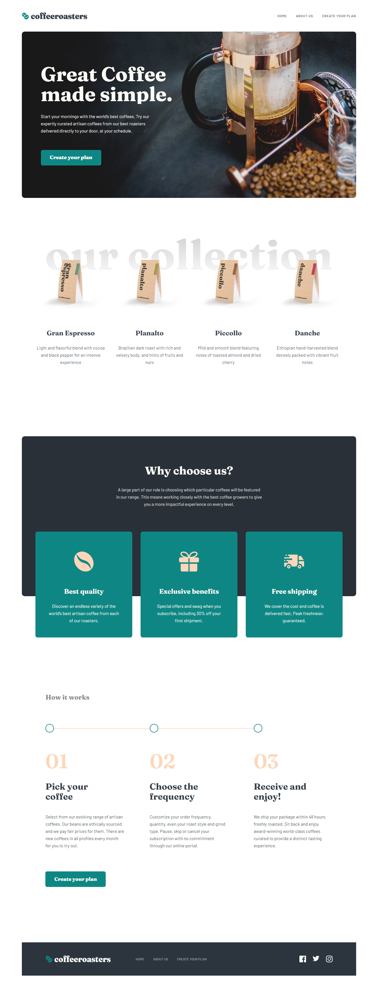

# Frontend Mentor - Coffeeroasters subscription site


This is a solution to the [Coffeeroasters subscription site](https://www.frontendmentor.io/challenges/coffeeroasters-subscription-site-5Fc26HVY6/hub/coffeeroasters-subscription-site-cfA_Leb5p). Frontend Mentor challenges help you improve your coding skills by building realistic projects. 

## Table of contents

- [Overview](#overview)
  - [The challenge](#the-challenge)
  - [Screenshot](#screenshot)
  - [Links](#links)
- [My process](#my-process)
  - [Built with](#built-with)
  - [What I learned](#what-i-learned)
  - [Continued development](#continued-development)
- [Author](#author)

## Overview

This challenge aims to further improve the capability of you to create multi page websites, with an addition of logic for the computations and handling for each element on the page.

### The challenge

Users should be able to:

- View the optimal layout for each page depending on their device's screen size
- See hover states for all interactive elements throughout the site
- Make selections to create a coffee subscription and see an order summary modal of their choices (details provided below)

### Expected bahaviour

The interactive subscription page has a number of specific behaviours, which are listed below:

- If "Capsule" is selected for the first option
  - The "Want us to grind them?" section should be disabled and not able to be opened
- Order summary texts updates
  - If "Capsule" is selected, update the order summary text to:
    - "I drink my coffee **using** Capsules"
    - Remove the grind selection text
  - If "Filter" or "Espresso" are selected, update the order summary text to:
    - "I drink my coffee **as** Filter||Espresso"
    - Keep/Add the grind selection text
  - For all other selections, add the selection title in the blank space where appropriate
- Updating per shipment price (shown in "How often should we deliver?" section at the bottom) based on weight selected
  - If 250g weight is selected
    - Every Week price per shipment is $7.20
    - Every 2 Weeks price per shipment is $9.60
    - Every Month price per shipment is $12.00
  - If 500g weight is selected
    - Every Week price per shipment is $13.00
    - Every 2 Weeks price per shipment is $17.50
    - Every Month price per shipment is $22.00
  - If 1000g weight is selected
    - Every Week price per shipment is $22.00
    - Every 2 Weeks price per shipment is $32.00
    - Every Month price per shipment is $42.00
- Calculating per month cost for the Order Summary modal
  - If Every Week is selected, the Order Summary modal should show the per shipment price multiplied by 4. For example, if 250g weight is selected, the price would be $28.80/month
  - If Every 2 Weeks is selected, the Order Summary modal should show the per shipment price multiplied by 2. For example, if 250g weight is selected, the price would be $19.20/month
  - If Every Month is selected, the Order Summary modal should show the per shipment price multiplied by 1. For example, if 250g weight is selected, the price would be $12.00/month

### Screenshot



### Links

Live Site URL: [Live site of the challenge](https://frontendmentor-coffee-roaster-subscription.app/)

## My process

Hi, thanks for checking out this project of mine!

This is my 24th project taken from frontendmentor and I took this challenge as my first premium challenge because this is my favorite design amongst the intermediate challenges in there.

Also, if you want to know how I got my premium subscription at frontendmentor, you can [ check and read here in a medium article](https://medium.com/frontend-mentor/2021-year-in-review-for-frontend-mentor-9226de88a6a9)

For this one, I used next.js to build out the whole website.

My thought process for this one is always first check thoroughly on the design given. I used figma to check and take notes of similarities of such sections and elements so that I could create reusable stylings.

In terms of styling, as it is my first time using styled components, I don't know if I implemented it right and created those reusable stylings....sighhs. But hey, i'm pretty proud on this one!

This project was started way back January but I just finished it this 24th of February! January and the start of February was really hectic in terms of scheduling as I got lots of school activs and projects and editing and lots more. Since those activs and projects are grouping, my time from coding shifted to it but if it were a single person activ/project, I could code more.

This project had me search a lot in usages of styled components, there are instances that I don't know if it was the right thing to add, but gladly that the documentation is enough to help me at it.

### Built with

- Semantic HTML5 markup
- Next.js
- React
- Styled Components
- Framer-motion
- Typescript
- react-tracked

### What I learned

#### Styled Components

Styled components is a react library where you can create styling wrappers for your elements. Basically, you don't need to worry about creating external stylesheets because you can just directy make you styling in your components directory and use that wrapper. It looks something like this:

```
  import styled from "styled-components";

  const Wrapper = styled.p`
    color: rgba(123, 53, 32, .8);
    ....
  `
```

Then you just use it like an element:
```
  <Wrapper>
    Hi! Thanks for checking this one out!!
  <Wrapper/>
```

I was having fun using this but I don't know if there is a proper way or convention of naming each styled components. That is why if you look at my namings, you will see a lot like of `StyledNavbarContainer`. I am pretty much of a verbose guy when explaining and kind of added it to naming, don't asky why :>>


This is my first time combining styled components with framer motion. I initially though that it will be very complex but rather find it fine to use. You just need to add the motion element as an argument in the styled function and adding the tagged template:
```
    import styled from "styled-components";
    import motion from "framer-motion";

    const Wrapper = styled(motion.p)`
      color: rgba(123, 53, 32, .8);
    ....
    `
```

Combining those up with typescript and global themes makes it really interesting to use!!

Also since you won't be able to just select properties inside of a string when making css in the styed-components, it is a hassle to create like media queries since it will be too much typing, hence creating your own functions to adjust stylings is really nice. I created some like `fluid`, `rem`, `breakpoints` just imported ones from whenever I used scss:

```
    import styled from "styled-components";
    import { fluid, rem, breakpoints } from "@/styled/shared/functions"; # in my directory

    const StyledNavbar = styled.nav`
      font-size: ${rem(20)};

      ${breakpoint("desktop", `
        padding: ${fluid(24, 6, 64)} ${rem(16)}
      `)}
    `

```

See how powerful styled component is!!! Writing css is really fun. Writing css > using css frameworks :>>

### Continued development

Finishing this project or actually continuing this project after long period of not coding at all due to school activs really brought up the previous me before the time of not coding these past months. I could code again really long period of times without me being burnt out.

As I finished this one, I will take and finish every challenges at frontendmentor that I could take. Not only finishing it, but making sure that for every challenge that I completed, it should be better in general compared to previous challenge submissions.

If you are tired, do what I do..... Drink a lot of water. I really love water and make sure that stay consistent and strive for being a better web developer ^^

## Author

- Website - Well I haven't made my profile portfolio, gonna make it sooon when I know a lot of things.
- Frontend Mentor - [@pikamart](https://www.frontendmentor.io/profile/pikamart)
- Twitter - [@RaymartPamplona](https://twitter.com/RaymartPamplona)